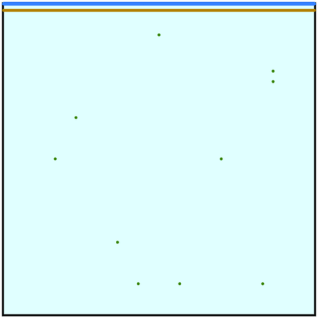

Fortune algorithm project
==========

### Installing dependencies

`sudo apt-get install cmake xorg-dev libglu1-mesa-dev`

### Structure and files

The project should contain:
 * this file (*README.md*)
 * the description of the structure of the program in **CMakeLists.txt**
 * a **src** directory with the source code. It contains:
     * **draw_tools.c / draw_tools.h**, the implementation of the visualization tools
     * an **alt** directory with the code for the Fortune's algorithm. It contains:
         * **main.c**, the main source file
         * **fortune.c / fortune.h**, the main implementation of the algorithm
         * **geometry.c / geometry.h**, the main geometric structures of the code
         * **draw.c / draw.h**, the code for the visualization
         * **event.c / event.h**, the structure of the events used in the algorithm
         * **bbst.c / bbst.h**, the implementation of a non-balanced binary search tree adapted for the algorithm
         * **pq.c / pq.h**, the implementation of a priority queue for the algorithm
 * a **gif** directory with an example of the algorithm
 * a **deps** directory with the dependency for the visualization
 * a file **CMakeLists.txt** to build the project 

The code also use the GNU module GList from GLIB.

### Execution
One compiled, you can run the program using the command `./exec`.  It accepts the following arguments :
 * -d X, print debug information if X is not 0
 * -v X, print information about the algorithm if X is not 0
 * -a X to choose the animation type
    * X = 0 : no animation
    * X = 1 : "continuous" animation (by default)
    * X = 2 : "step-by-step" animation
 * -c X, draw circles if X is not 0
 * -C X, highlight the cell containing the cursor if X is not 0
 * -b X, draw beachline if X is not 0
 * -s X, draw sweepline if X is not 0
 * -t X, set the simulation time
    * if the animation is continuous, set the total time of the simluation to X
    * if the animation is step-by-step,, set the time of a step to X
 * -g folder_name, save printscreens of the animation in the specified folder name.  

If the option -g is enabled, the animation is recorded and you can create a gif of the animation using the ImageMagick package for example

